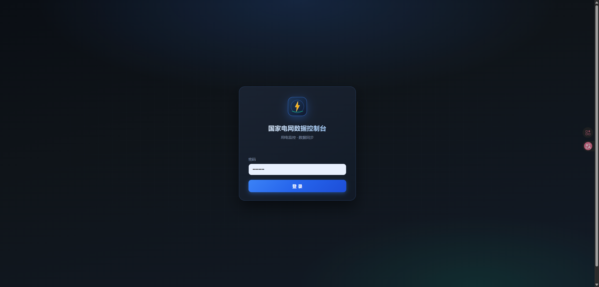
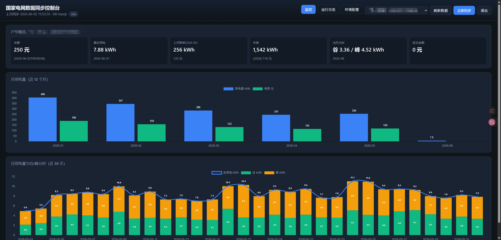

# 国家电网电费数据获取

[](https://github.com/Poiig/ha_sgcc_electricity/actions/workflows/docker-publish.yml)

将国家电网（95598）的电费、用电量、分时电量、阶梯用电数据接入 Home Assistant，支持腾讯验证码自动识别。

## 致谢

- [ARC-MX/sgcc_electricity_new](https://github.com/ARC-MX/sgcc_electricity_new) — 项目基础框架和数据抓取逻辑
- [renxiaoyaoo/ha-95598](https://github.com/renxiaoyaoo/ha-95598) — 点选验证码识别方案参考

本项目遵循 Apache License 2.0 协议。

**最新版本：[v2.0.0](https://github.com/Poiig/ha_sgcc_electricity/releases/tag/v2.0.0)** · [更新日志](CHANGELOG.md)

---

## 功能

- 自动登录国家电网（支持点选/滑块验证码自动识别）
- 支持二维码扫码登录（测试时更方便）
- 通过 Home Assistant REST API 推送传感器数据
- 支持每日/月度/年度分时电量（谷/平/峰/尖）采集
- 支持住宅用户阶梯用电数据（一/二/三阶已用、剩余、当前阶段）
- 支持电费余额增强信息（应交金额）
- 统一数据库表设计（SQLite / MySQL），支持数据保留天数配置
- 用户名自动从网站获取，无需手动配置映射
- 忽略户号仅跳过抓取，保留数据库历史数据
- 密码登录失败自动切换二维码登录兜底
- 电费余额不足通知（PushPlus / URL / 企业微信）
- 同步完成后企业微信推送多户汇总（余额、日/月/年用电、当月分时、应交金额）
- **Web 控制台**：浏览器查看运行日志、户号图表、手动触发同步（[说明](docs/WEB_DASHBOARD.md)）

### Web 控制台（效果预览）

启用 `WEB_DASHBOARD=true` 后，访问 `http://<主机>:8080/` 登录即可查看多户用电概览、阶梯用电、日/月图表与同步记录。默认登录密码为 `password`（请在 `.env` 中修改 `WEB_DASHBOARD_PASSWORD`）。

| 登录页 | 监控大屏 |
|:---:|:---:|
|  |  |

### 企业微信同步汇总（效果预览）

配置 `PUSH_TYPE=wework` 与 `WEWORK_WEBHOOK_URL` 后，每次抓取成功会向群机器人推送 Markdown 汇总。以下为**脱敏示例**（户名、户号为虚构数据）：

```
国家电网数据同步完成
同步时间：2026-06-02 15:21:06
成功户号：2 个

示例（电动车）
户号：3200000000001
余额：150.0 元
最近用电：0.0 kWh (2026-06-01)
上月（5月1日-5月31日）：311 kWh / 119 元
当月累计（2026-06）：0.0 kWh
年度：2215 kWh / 862 元
应交金额：0.0 元

示例（住宅）
户号：3200000000002
余额：250.0 元
最近用电：7.88 kWh (2026-06-01)
上月（5月1日-5月31日）：256 kWh / 120 元
当月累计（2026-06）：7.88 kWh
当月分时：谷 3.36 / 峰 4.52 kWh
年度：1542 kWh / 718 元
应交金额：0.0 元
```

多户家庭一次同步即可掌握各户余额与用电概况；余额低于阈值时还会单独推送提醒。详见 `WEWORK_PUSH_SUMMARY`、`BALANCE` 环境变量。

### 传感器列表

| 实体 | 说明 |
|------|------|
| `sensor.electricity_charge_balance_xxxx` | 电费余额（元） |
| `sensor.last_electricity_usage_xxxx` | 最近一天用电量（kWh） |
| `sensor.yearly_electricity_usage_xxxx` | 今年总用电量（kWh） |
| `sensor.yearly_electricity_charge_xxxx` | 今年总电费（元） |
| `sensor.month_electricity_usage_xxxx` | 最近一个月用电量（kWh） |
| `sensor.month_electricity_charge_xxxx` | 上月总电费（元） |
| `sensor.month_valley_usage_xxxx` | 当月谷时用电量（kWh，**需启用数据库**，见下方说明） |
| `sensor.month_flat_usage_xxxx` | 当月平时用电量（kWh，**需启用数据库**） |
| `sensor.month_peak_usage_xxxx` | 当月峰时用电量（kWh，**需启用数据库**） |
| `sensor.month_tip_usage_xxxx` | 当月尖时用电量（kWh，**需启用数据库**） |
| `sensor.prepay_balance_xxxx` | 预付费余额/应交金额（元） |
| `sensor.step_used_step1_xxxx` | 阶梯一阶已用电量（kWh，住宅用户） |
| `sensor.step_remain_step1_xxxx` | 阶梯一阶剩余电量（kWh，住宅用户） |
| `sensor.step_used_step2_xxxx` | 阶梯二阶已用电量（kWh，住宅用户） |
| `sensor.step_remain_step2_xxxx` | 阶梯二阶剩余电量（kWh，住宅用户） |
| `sensor.step_used_step3_xxxx` | 阶梯三阶已用电量（kWh，住宅用户） |
| `sensor.step_total_usage_xxxx` | 阶梯累计用电量（kWh，住宅用户） |
| `sensor.step_stage_xxxx` | 当前阶梯阶段（1/2/3，住宅用户） |

> 适用于国家电网覆盖省份（南方电网省份不可用），支持 `linux/amd64`、`linux/arm64`。

---

## 验证码识别

登录时可能遇到腾讯**点选**或**滑块**验证码。本项目提供两种识别方式，通过环境变量 `CAPTCHA_SOLVER` 切换：

| 模式 | 配置值 | 说明 |
|------|--------|------|
| 本地 OCR（**默认**） | `local` | 免费，基于 ddddocr + 图像匹配，适合点选验证码 |
| 大模型视觉识别 | `llm` | 火山引擎豆包，支持点选 + 滑块（[接入指南](docs/LLM_CAPTCHA.md)） |

本地 OCR 无法满足时可切换大模型模式，或直接使用 `LOGIN_METHOD=qrcode` 扫码登录绕过验证码。

### 大模型模式（CAPTCHA_SOLVER=llm）

使用火山引擎豆包通过 OpenAI 兼容接口自动解算验证码，识别率高于本地 OCR，支持点选 + 滑块。

```env
CAPTCHA_SOLVER=llm
LLM_API_KEY=your-api-key-here
LLM_BASE_URL=https://ark.cn-beijing.volces.com/api/v3
LLM_MODEL=doubao-seed-2-0-pro-260215
```

注册账号、获取 API Key、费用与日志说明见 **[docs/LLM_CAPTCHA.md](docs/LLM_CAPTCHA.md)**。

---

## 安装部署

### 方式一：Home Assistant Add-on（推荐）

1. 进入 `设置` → `加载项` → `加载项商店`
2. 右上角 `...` → `仓库`，添加：`https://github.com/Poiig/ha_sgcc_electricity`
3. 刷新页面，找到 **国家电网电费数据获取** 并安装
4. 切换到 `配置` 标签，填写手机号、密码、HA 地址和令牌
5. 保存配置，启动 Add-on

### 方式二：Docker Compose

```bash
mkdir ha_sgcc_electricity && cd ha_sgcc_electricity
curl -O https://raw.githubusercontent.com/Poiig/ha_sgcc_electricity/master/docker-compose.yml
curl -O https://raw.githubusercontent.com/Poiig/ha_sgcc_electricity/master/example.env
cp example.env .env && vim .env
docker compose up -d --force-recreate
```

**镜像地址：**

| 来源 | 地址 |
|------|------|
| GHCR | `ghcr.io/poiig/ha_sgcc_electricity:latest` |
| GHCR 国内加速 | `ghcr.nju.edu.cn/poiig/ha_sgcc_electricity:latest` |
| Docker Hub | `poiigzhao/ha_sgcc_electricity:latest` |
| Docker Hub 国内加速 | `docker.1ms.run/poiigzhao/ha_sgcc_electricity:latest` |

### 方式三：本地运行

详见 [LOCAL_DEV_GUIDE.md](LOCAL_DEV_GUIDE.md)

```bash
pip install -r requirements.txt
cp example.env .env && vim .env
cd scripts && python main.py
```

---

## 运行日志示例

以下为 Docker 容器一次完整抓取的**省略版**日志，便于对照预期流程。手机号、户号、户名、内网地址均为**虚拟示例**，与真实数据无关。

```
2026-05-21 15:47:51  [INFO] ---- 当前运行在 Docker 容器中
2026-05-21 15:47:51  [INFO] ---- 登录账号: 13000000001
2026-05-21 15:47:51  [INFO] ---- RUN_ON_STARTUP=true (生效: 是)
2026-05-21 15:47:51  [INFO] ---- 当前版本: 20260521-xxxx，仓库地址: https://github.com/Poiig/ha_sgcc_electricity
2026-05-21 15:47:51  [INFO] ---- 验证码识别模式: 本地 OCR/图像匹配
2026-05-21 15:47:51  [INFO] ---- 使用 MySQL 数据库存储数据
2026-05-21 15:47:51  [INFO] ---- 登录账号: 13000000001，Home Assistant 地址: http://homeassistant.local:8123/，每天 09:25 定时同步
2026-05-21 15:47:51  [INFO] ---- 定时任务已注册，每天 09:25 和 21:25 各执行一次
2026-05-21 15:47:51  [INFO] ---- RUN_ON_STARTUP 已启用，启动后立即执行登录与数据抓取...

# --- 登录 ---
2026-05-21 15:47:52  [INFO] ---- 使用 Chromium 浏览器 (Docker headless 模式)
2026-05-21 15:48:22  [INFO] ---- 已打开登录页面
2026-05-21 15:50:29  [INFO] ---- 登录后页面状态: 验证码
2026-05-21 15:50:29  [INFO] ---- 本地验证码检测: 类型=点选
2026-05-21 15:50:30  [INFO] ---- 第 0 次尝试未找到可靠方案
2026-05-21 15:50:45  [INFO] ---- 第 1 次尝试所有点选方案均失败
2026-05-21 15:51:09  [INFO] ---- 第 3 次尝试点选验证码识别成功
2026-05-21 15:51:29  [INFO] ---- 登录成功

# --- 获取户号 ---
2026-05-21 15:54:12  [INFO] ---- 从 el-select 获取到用户: 3200000000001 (示例（电动车）)
2026-05-21 15:54:52  [INFO] ---- 从 el-select 获取到用户: 3200000000002 (示例（住宅）)
2026-05-21 15:56:33  [INFO] ---- 共获取到 4 个用户，其中 2 个在忽略列表中将被跳过

# --- 户号 1：电动车（3200000000001）---
2026-05-21 15:57:38  [INFO] ---- [3200000000001] 电费余额: 0.0 元
2026-05-21 15:57:38  [INFO] ---- [3200000000001] 非住宅用户，跳过阶梯用电查询
2026-05-21 15:58:41  [INFO] ---- [3200000000001] 年度用电量: 1904 kWh，年度电费: 743 元
2026-05-21 15:59:01  [INFO] ---- [3200000000001] 4月1日-4月30日: 用电 483 kWh, 电费 197 元
2026-05-21 16:01:01  [WARNING] ---- [3200000000001] DOM 获取最近一日用电失败，将用批量日数据补充
2026-05-21 16:04:21  [INFO] ---- [3200000000001] [Vue state] 获取 31 天日用电数据
2026-05-21 16:04:21  [INFO] ----   [每日用电] 2026-05-20 ~ 2026-04-20 共 31 条（略）
2026-05-21 16:04:22  [INFO] ---- [3200000000001] 每日用电量已写入 31 条
2026-05-21 16:04:22  [INFO] ---- [3200000000001] 当月 2026-05 分时已汇总写入 monthly_usage
2026-05-21 16:04:22  [INFO] ---- [3200000000001] 当月 2026-05 分时汇总 (20 天): 谷=164.42, 峰=0.0 kWh
2026-05-21 16:04:22  [INFO] ---- [3200000000001] 开始更新 Home Assistant 数据...
2026-05-21 16:04:22  [INFO] ---- 当月谷时用电量 【sensor.month_valley_usage_0001】 已更新: 164.42 kWh
2026-05-21 16:04:22  [INFO] ---- [3200000000001] Home Assistant 数据更新完成

# --- 户号 2：住宅（3200000000002）---
2026-05-21 16:06:07  [INFO] ---- [3200000000002] 电费余额: 0.0 元
2026-05-21 16:08:10  [INFO] ---- [3200000000002] 阶梯用电: 2026-05, 一阶已用=1286kWh, 阶段=1
2026-05-21 16:09:53  [INFO] ---- [3200000000002] 年度用电量: 1286 kWh，年度电费: 598 元
2026-05-21 16:10:13  [INFO] ---- [3200000000002] 4月1日-4月30日: 用电 247 kWh, 电费 116 元
2026-05-21 16:15:34  [INFO] ---- [3200000000002] 每日用电量已写入 31 条
2026-05-21 16:15:34  [INFO] ---- [3200000000002] 当月 2026-05 分时汇总 (20 天): 谷=69.96, 峰=86.38 kWh
2026-05-21 16:15:35  [INFO] ---- 当月峰时用电量 【sensor.month_peak_usage_0002】 已更新: 86.38 kWh
2026-05-21 16:15:35  [INFO] ---- 阶梯一阶已用电量 【sensor.step_used_step1_0002】 已更新: 1286.0 kWh
2026-05-21 16:15:35  [INFO] ---- [3200000000002] Home Assistant 数据更新完成

# --- 收尾 ---
2026-05-21 16:15:55  [INFO] ---- 用户 3200000000003 在忽略列表中, 跳过
2026-05-21 16:15:55  [INFO] ---- 用户 3200000000004 在忽略列表中, 跳过
2026-05-21 16:15:55  [INFO] ---- 所有用户数据处理完成, 关闭浏览器
2026-05-21 16:15:55  [INFO] ---- 已发送企业微信数据汇总，共 2 个户号
2026-05-21 16:15:55  [INFO] ---- 从缓存恢复户号数据并回写 HA  （×2，notify=false）
```

**日志阶段说明：**

| 阶段 | 关键日志 |
|------|----------|
| 启动 | Docker 环境、定时任务、`RUN_ON_STARTUP` |
| 登录 | 验证码识别（可能多次重试）、登录成功 |
| 户号 | 从下拉框自动发现，忽略列表生效 |
| 抓取 | 余额 / 年月度 / 日用电 31 条 / 阶梯（住宅） |
| 入库 | 写入 `daily_usage` → SQL 汇总当月分时 → `monthly_usage` |
| HA | 更新传感器；分时传感器依赖数据库汇总结果 |
| 收尾 | 企微汇总推送、缓存回写 HA（不重复发余额通知） |

---

## Home Assistant 配置

需要在 `configuration.yaml` 中配置 template 以确保 HA 重启后实体可用，详见 [docs/HA_CONFIG.md](docs/HA_CONFIG.md)。

---

## 环境变量

Docker Compose 方式通过 `.env` 文件配置，完整配置项见 `example.env`。

**必填：**

| 变量 | 说明 |
|------|------|
| `PHONE_NUMBER` | 95598 登录手机号 |
| `PASSWORD` | 95598 登录密码 |
| `HASS_URL` | Home Assistant 地址 |
| `HASS_TOKEN` | HA 长期访问令牌 |

**常用可选：**

| 变量 | 默认值 | 说明 |
|------|--------|------|
| `LOGIN_METHOD` | password | 登录方式（password / qrcode） |
| `LOGIN_FALLBACK` | qrcode | 登录失败备选（qrcode / none） |
| `JOB_START_TIME` | `09:30` | 每天同步开始时间 |
| `RUN_ON_STARTUP` | `false` | Docker 启动后立即登录抓取 |
| `CAPTCHA_SOLVER` | `local` | 验证码识别：`local` 本地 OCR / `llm` 豆包大模型（[接入指南](docs/LLM_CAPTCHA.md)） |
| `LLM_API_KEY` | — | 火山方舟 API Key（`CAPTCHA_SOLVER=llm` 时必填） |
| `LLM_BASE_URL` | `https://ark.cn-beijing.volces.com/api/v3` | 豆包 OpenAI 兼容 API 地址 |
| `LLM_MODEL` | `doubao-seed-2-0-pro-260215` | 调用的视觉模型 |
| `DB_TYPE` | sqlite | 数据库类型（**默认 sqlite**；none 不存储且跳过当月分时传感器） |
| `DAILY_FETCH_DAYS` | 30 | 每次获取日用电量天数（7 或 30） |
| `DATA_RETENTION_DAYS` | 365 | 数据库记录保留天数 |
| `IGNORE_USER_ID` | 空 | 忽略的户号（逗号分隔） |
| `PUSH_TYPE` | none | 通知方式（none / pushplus / urlpush / wework） |
| `WEWORK_WEBHOOK_URL` | — | 企业微信群机器人 Webhook（`PUSH_TYPE=wework` 时必填） |
| `WEWORK_PUSH_SUMMARY` | true | 抓取成功后推送多户汇总 |
| `WEB_DASHBOARD` | true | 启用 Web 控制台（[说明](docs/WEB_DASHBOARD.md)） |
| `WEB_DASHBOARD_PORT` | 8080 | 控制台端口（Docker host 网络） |
| `WEB_DASHBOARD_PASSWORD` | password | 控制台登录密码 |
| `FETCH_COOLDOWN_MINUTES` | 30 | 手动同步冷却时间 |
| `BALANCE` | 5.0 | 余额低于此值时通知（需开启 PUSH_TYPE） |

---

## 数据库

**默认启用 SQLite**（`DB_TYPE=sqlite`），无需额外安装数据库服务，数据文件保存在 `data/` 目录（Docker 下为 `/data`）。

| `DB_TYPE` | 说明 |
|-----------|------|
| `sqlite` | **默认**。本地 SQLite 文件，适合单机 / Docker 部署 |
| `mysql` | 连接外部 MySQL，适合多实例共享或已有 MySQL 环境 |
| `none` | 不写入数据库；**当月谷/平/峰/尖四个分时传感器不会更新**（无日用电数据可汇总） |

启用数据库后，程序自动创建 6 张表存储用电数据（含阶梯用电），详见 [docs/DATABASE.md](docs/DATABASE.md)。

### 当月分时传感器与数据库的关系

`sensor.month_valley_usage_xxxx` 等四个分时传感器，统计的是**当前自然月**（例如 5 月即 `2026-05`）已入库的日用电数据，通过 SQL 从 `daily_usage` 表汇总谷/平/峰/尖电量。

因此：

- 必须配置 `DB_TYPE=sqlite` 或 `DB_TYPE=mysql`，且每次抓取会写入日用电记录
- `DB_TYPE=none` 时，上述四个传感器**跳过更新**
- 数据库里某月有多少天的日记录，当月分时就汇总多少天；历史越完整，当月累计越准确

与 `sensor.month_electricity_usage_xxxx`（上个**账单月**总用电量）的统计周期不同，请勿直接对比数值。

---

## 常见问题

**Q: 验证码识别失败**
> 检查 `data/pages/` 下的调试截图。可切换 `CAPTCHA_SOLVER=llm` 或 `LOGIN_METHOD=qrcode` 扫码登录。国网每天有登录次数限制。

**Q: RK001 网络连接超时**
> 国网检测到异常登录频率，等待几小时后重试。

**Q: 阶梯用电传感器无数据**
> 仅住宅用户（户名含「住宅」）有阶梯数据，充电桩等非住宅户号会自动跳过。

**Q: 分时电量数据为空**
> 当月谷/平/峰/尖传感器依赖数据库：请确认 `DB_TYPE` 为 `sqlite`（默认）或 `mysql`，**不要设为 `none`**。程序会从 `daily_usage` 表汇总当前自然月的日用电分时；若库中尚无当月记录，传感器不会更新。部分省份日数据可能不含分时字段。

**Q: HA Add-on 启动报 Duplicate mount point**
> 升级到 v2.0.0+ 已修复此问题。如仍出现，卸载重装 Add-on。

---

## License

[Apache License 2.0](LICENSE)
